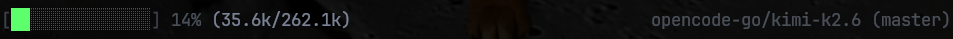
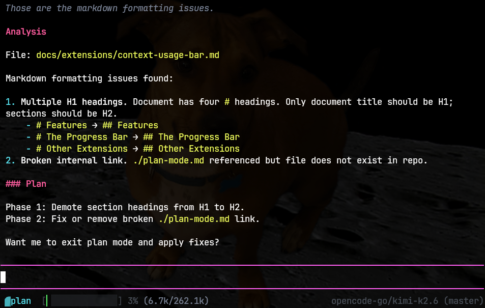

# dave-pi-extensions

Minimalist [Pi](https://pi.dev/) extensions, favoring deterministic code over internal prompting logic, and aggressively minimizing external dependencies.

The Pi coding agent knows how to rewrite and customize itself using extensions and a "Pi SDK". The extensions are written with TypeScript and run on NodeJS.

So many features in Claude Code are implemented as prompts, glued together with a bit of TypeScript. With a Pi, we can instead create deterministic hooks and extensions and only use prompts when inference is actually required.

## Should I Use This?

Probably not. Part of the fun of using `pi` is slowly forming it and "bootstrapping" your own personal process. These extensions match the way I like to work with a coding agent and it was fun to build and test them.

However, you could just ask `pi` to read this repository and say "I want to implement an extension like that, but with the following changes ...". Or probably pick a better repository to copy from, but you get the idea.

## Dependencies

I'd like to say "no external dependencies" besides the pI SDK and node built-ins, but I decided to add [bash-parser](https://github.com/vorpaljs/bash-parser/tree/master) to improve the [plan-mode](./docs/extensions/plan-mode.md) and [pi-gate](./docs/extensions/pi-gate.md) extensions by more accurately parsing bash commands instead of trying to do it with regular expressions. This added a few transitive dependencies but they were all very simple and seemingly benign.

And then the "dev dependencies" add a ton of transitive dependencies but those are not part of the extensions a user would install.

I wish this used [Deno](https://deno.com/) because I like that all the dev tools are built-in (lint, test and assertions, format, type checking, etc) and that it has a standard library you can leverage to avoid the need for additional external dependencies.

Honestly, the thing adding the most external dependencies to this project is the Pi SDK itself. I don't see why we need to install all of the various dependencies for the agent itself when we only want to interact with the TUI extensions API. I wish they would split this into multiple packages so I could avoid having so many extra dependencies for this Pi package.

## Extensions

### context-usage-bar

Simple 1-line context bar with token usage, provider and model, git branch, and a color-coded context window "progress bar".

[Read more here](./docs/extensions/context-usage-bar.md).

### plan-mode

Pi doesn't ship with a "plan mode" feature. Instead, you can just ask it to "present a detailed implementation plan" and save it to a file.

But if you forget to word it properly, or if the model just decides to start implementing it, you don't have a lot of control over what it's going to do.

So this extension implements a simple handler to hook into tool calls to prevent the model from making any changes and updates the system prompt to tell it to "present a plan" instead of taking an action. It also has a visual indicator that shows up in the context bar when plan mode is active.

> TODO: Grab a better preview image with a proper plan.

[Read more here](./docs/extensions/plan-mode.md).

### pi-gate (SG1)

`Pi` also doesn't come with any "guard rails", like asking for approval before running bash commands or modifying files. The suggestion is that you should run `pi` in a container or sandbox and/or use a community plugin (or build your own).

I made my own, and I stripped it down to work the way I like, based on a simple system that defaults to "ask" for all actions but allows you to build up a list of session, project, and global white-lists using glob patterns. Over time, you tune your agent to run autonomously within it's guard-rails, and you only get prompted when it does something sus.

> TODO: image here

I do also run `pi` in a [Bubblewrap](https://github.com/containers/bubblewrap) sandbox.

[Read more here](./docs/extensions/pi-gate.md).

### rtk-bash-wrapper

> NOTE: I'm going to replace this with [pi-rtk](https://github.com/mcowger/pi-rtk).

### tmux-agents

TODO

## Themes
