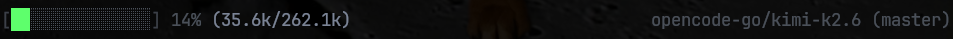
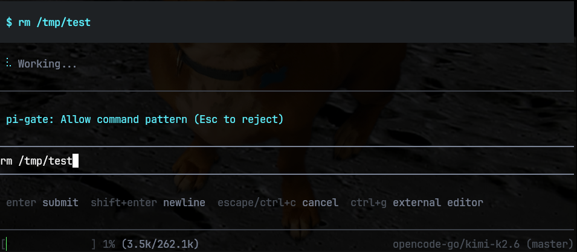
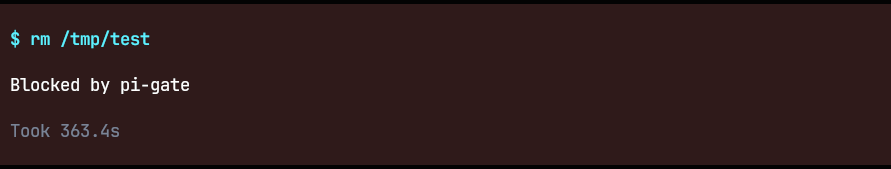

# dave-pi-extensions

Minimalist [Pi](https://pi.dev/) extensions with minimal external dependencies.

## Should I Use This?

Probably not. Part of the fun of using `pi` is slowly forming it and "bootstrapping" your own personal process. These extensions match the way I like to work with a coding agent and it was fun to build and test them.

However, you could just ask `pi` to read this repository and say "I want to implement an extension like that, but with the following changes ...". Or probably pick a better repository to copy from, but you get the idea.

## Dependencies

I'd like to say "no external dependencies" besides the pi SDK and node built-ins, but I decided to add [bash-parser](https://github.com/vorpaljs/bash-parser/tree/master) to improve the [pi-gate](./docs/extensions/pi-gate.md) extension by more accurately parsing bash commands instead of trying to do it with regular expressions. This added a few transitive dependencies but they were all very simple and seemingly benign.

## Extensions

### context-usage-bar

Simple 1-line context bar with token usage, provider and model, git branch, and a color-coded context window "progress bar".

[Read more here](./docs/extensions/context-usage-bar.md).

### pi-gate (SG1)

`Pi` also doesn't come with any "guard rails", like asking for approval before running bash commands or modifying files. The suggestion is that you should run `pi` in a container or sandbox and/or use a community plugin (or build your own).

I made my own, and I stripped it down to work the way I like, based on a simple system that defaults to "ask" for all actions but allows you to build up a list of session, project, and global white-lists using glob patterns. Over time, you tune your agent to run autonomously within it's guard-rails, and you only get prompted when it does something sus.

I do also run `pi` in a [Bubblewrap](https://github.com/containers/bubblewrap) sandbox.

[Read more here](./docs/extensions/pi-gate.md).

## Themes

I generated a couple of color themes based on popular open-source themes. I use a dark color background, usually with transparent background. I like a vibrant, bright color scheme with high contrast.

- carbonfox.json - [Carbonfox](https://github.com/EdenEast/nightfox.nvim)
- cyberdream.json - [Cyberdream](https://github.com/scottmckendry/cyberdream.nvim) (I use this for neovim)
- dracula.json - [Dracula](https://github.com/dracula/dracula-theme)
