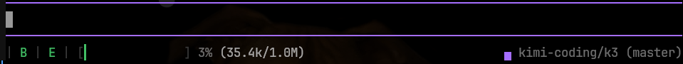
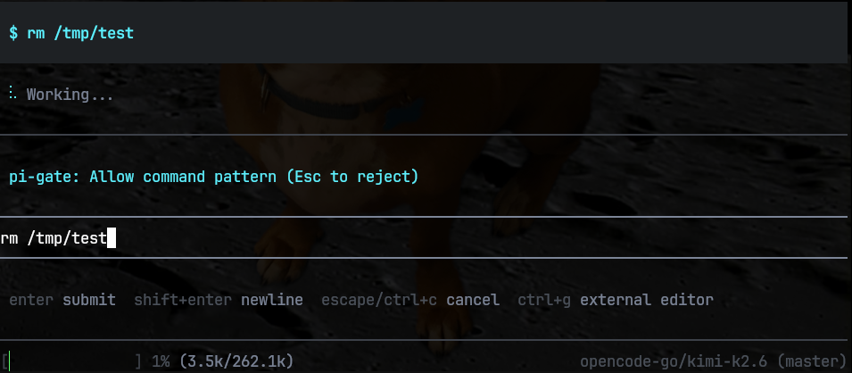
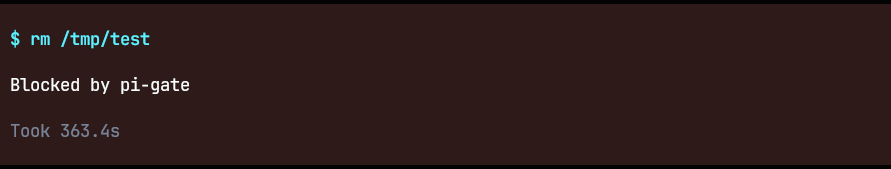
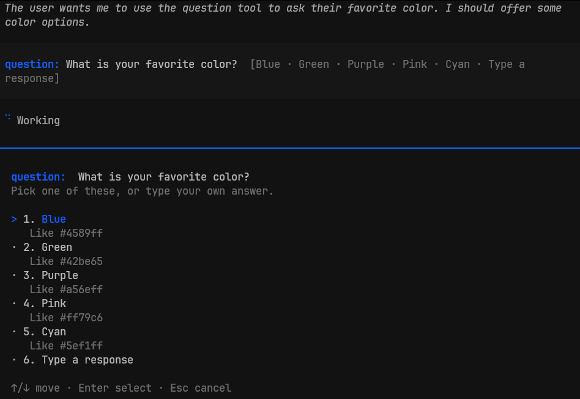
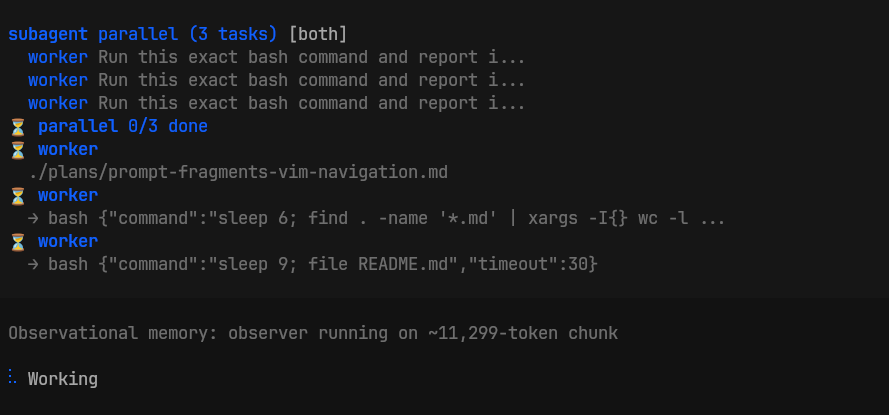
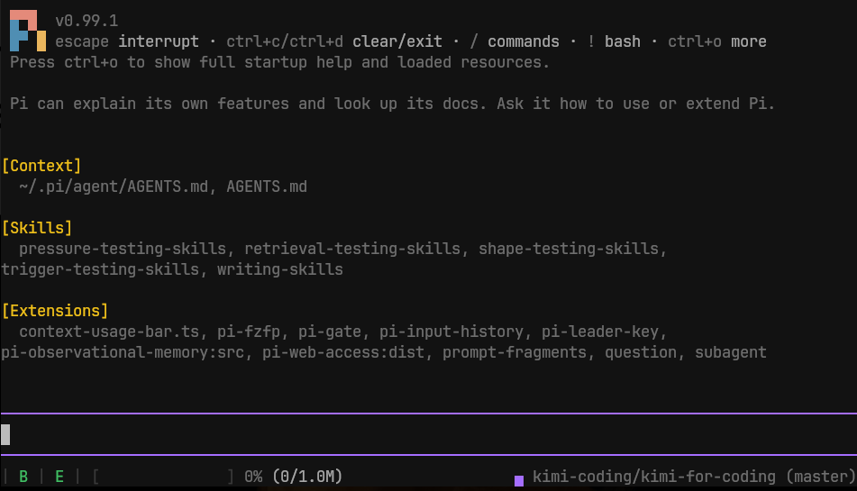
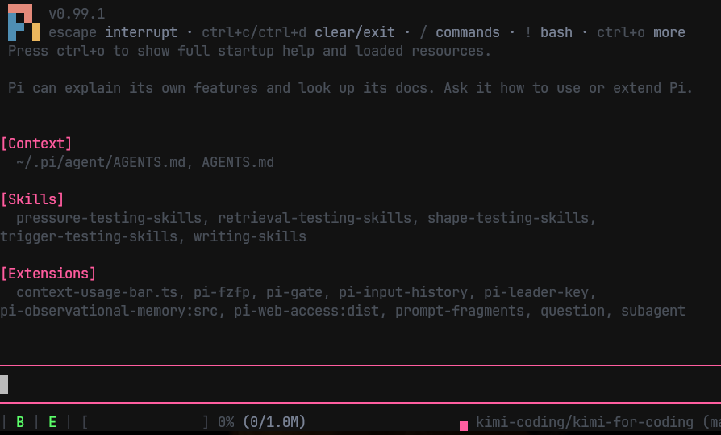
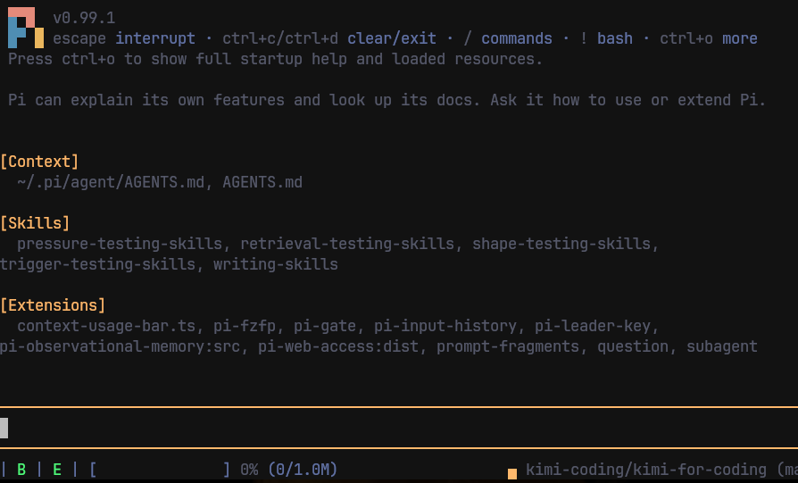

# dave-pi-extensions

Minimalist [Pi](https://pi.dev/) extensions with minimal external dependencies.

## Should I Use This?

Probably not. These are highly bespoke and completely vibe-coded. Part of the fun of using `pi` is slowly forming it and "bootstrapping" your own personal process. These extensions match the way I like to work with a coding agent and it was fun to build and test them.

However, you could just ask `pi` to read this repository and say "I want to implement an extension like that, but with the following changes ...". Or probably pick a better repository to copy from, but you get the idea. Just like you probably wouldn't use my vim config but you might look to see if there is anything interesting you can borrow or extend.

## Dependencies

I'd like to say "no external dependencies" besides the pi SDK and node built-ins, but I decided to add [bash-parser](https://github.com/vorpaljs/bash-parser/tree/master) to improve the [pi-gate](./docs/extensions/pi-gate.md) extension by more accurately parsing bash commands instead of trying to do it with regular expressions. This added a few transitive dependencies but they were all very simple and seemingly benign.

## Extensions

### context-usage-bar



Simple 1-line context bar with token usage, provider and model, reasoning-effort indicator, git branch, and a color-coded context window "progress bar".

**Features:**

- Input and output token counts with a compact `121.5k/200.0k` style summary.
- A color-coded context usage progress bar based on absolute token thresholds, not percentage of the window:
  - Green below 80K tokens (the "smart zone")
  - Yellow from 80K to 120K tokens (warning)
  - Red above 120K tokens (the ["Dumb Zone"](https://youtu.be/rmvDxxNubIg?si=O17nmS3SScaAkpp-&t=355))
- A single-character reasoning-effort indicator next to the model name, colored with the same theme color as the prompt input border for that level (`·` off, `▁` minimal, `▂` low, `▃` medium, `▄` high, `▅` xhigh, `█` max).
- Current git branch.
- When pi-gate is loaded, `B`/`E` guard-state indicators show whether the bash and external-file guards are enabled.
- Statuses from other extensions are displayed to the left of the model info.

**Configuration:** none — the thresholds are constants in the source (`YELLOW_THRESHOLD = 80_000`, `RED_THRESHOLD = 120_000`). The bar can be toggled at runtime with the `/context-bar` command.

### pi-gate (SG1)

`Pi` also doesn't come with any "guard rails", like asking for approval before running bash commands or modifying files. The suggestion is that you should run `pi` in a container or sandbox and/or use a community plugin (or build your own).

I made my own, and I stripped it down to work the way I like, based on a simple system that defaults to "ask" for all actions but allows you to build up a list of session, project, and global white-lists using glob patterns. Over time, you tune your agent to run autonomously within it's guard-rails, and you only get prompted when it does something sus.





**Features:**

- Bash guard: every bash command is parsed into an AST with [bash-parser](https://github.com/vorpaljs/bash-parser/tree/master), and each command and file path extracted from it is checked individually against the white-lists.
- External file guard: Read, Write, Edit, Find, and Grep tool calls (and paths extracted from Bash calls) targeting files outside the project root are checked the same way. A path is allowed when a white-list entry exactly equals it, is a directory prefix of it, or matches it as a glob.
- Approval flow: approve an exact command/path once for the session, edit it into a broader glob pattern, and optionally save the pattern to the global or project config.
- LLM judge: commands that defeat the bash parser (heredocs, exotic quoting) can be vetted by a configurable verification model that returns a YES/NO verdict, with a manual-approval fallback when it is unset, errors, times out, or returns an ambiguous verdict. Verdicts are recorded as expandable `pi-gate-verdict` transcript entries.
- Session toggles: `/pi-gate-bash` and `/pi-gate-external` flip each guard independently for the current session (both re-enable on `/new`).

**Configuration:** two JSON files whose allow-lists are simply joined into one effective white-list (no override logic):

- Global: `~/.pi/agent/pi-gate.json`
- Project: `./.pi/pi-gate.json`

Settings:

| Setting                    | Scope       | Meaning                                                                  |
| -------------------------- | ----------- | ------------------------------------------------------------------------ |
| `bashAllow`                | both        | Glob patterns for pre-approved bash commands (e.g. `"git status*"`).     |
| `externalAllow`            | both        | Paths/globs for pre-approved external file access (e.g. `"/tmp/*"`).     |
| `commandVerificationModel` | global only | `"provider/modelId"` string for the LLM judge; omit to disable it.       |

The extension never writes the config files itself except when you choose to save an approved pattern.

### prompt-fragments

Prepend or append reusable prompt fragments to the editor via a multi-select picker, driven by the `/fragments-prepend` and `/fragments-append` commands. Selected fragments are joined to the current editor text with a single blank line between each block.

To make this useful, I use [pi-leader-key](https://github.com/mmyers0114/pi-leader-key) to add vim-like leader-key shortcuts and map "prepend" and "append" to their own keys.

**Features:**

- Two independent fragment lists: `prepend` (boilerplate that goes before your message) and `append` (reminders that go after it).
- Interactive multi-select picker; cancelling leaves the editor untouched.

**Configuration:** a single global JSON file, `~/.pi/agent/prompt-fragments.json`:

```json
{
  "prepend": [
    { "name": "context", "prompt": "We are working on the pi-gate extension." }
  ],
  "append": [
    { "name": "tests", "prompt": "Run the tests when you are done." }
  ]
}
```

A missing file is not an error — the commands just notify that no fragments are defined.

### question



Ask the user a single multiple-choice question with an always-available free-form escape hatch. It renders a title, an optional description, and a menu of options, then blocks until one is picked (or the user types their own answer).

This is just a simple clone of the `question` or `ask` tool provided by other popular coding assistants.

**Features:**

- A `question` tool the model can call when a decision genuinely requires human input.
- A "Type a response" row is always available (can be disabled with `allowOther: false`), so the user can override the proposed choices.
- Keyboard navigation: `↑`/`↓` to move (wrapping), `Enter` to accept or open the free-form editor, `Escape` to cancel.
- A cancelled answer is returned as `The user declined to answer.` — not an error — so the model can proceed or re-ask.
- Runs sequentially (cannot overlap other tool calls) and requires an interactive TUI session; in non-interactive modes the call fails with a clear error instead of hanging.

**Configuration:** none.

### subagent



Delegate tasks to headless `pi --mode rpc` child processes with isolated
context. Ships one bundled `worker` agent; drop `.md` agent definitions in
`~/.pi/agent/agents/` (global) or `.pi/agents/` (project, wins on name
collision) to add your own.

The parent session is the RPC client, so anything that would prompt in the
child — a `ctx.ui.confirm` from an extension like pi-gate, or the child's
`contact_supervisor` tool — is relayed to your primary session for approval,
and running subagents stream their most recent output line (80 cols) as
live status.

**Features:**

- A `subagent` tool with two modes: a single task (`{ agent, task, cwd? }`) or a parallel batch (`{ tasks: [...] }`, max 8 tasks, 4 running at a time) that blocks until every child finishes.
- Agents are markdown files with YAML frontmatter (`name`, `description`, optional `tools` allowlist, optional `model` override); the body becomes the child's appended system prompt.
- Three-tier discovery with precedence **project > user > bundled**: the bundled `worker`, `~/.pi/agent/agents/`, and the nearest `.pi/agents/` walking up from the session cwd.
- Approval relay: child dialogs (`confirm`, `select`, `input`, `editor`) arrive in the primary session as ordinary pi dialogs and queue one at a time; `contact_supervisor` lets a blocked child ask a free-form question.
- Project-sourced agents in untrusted projects require a one-shot confirmation before spawning (fails closed when no UI is available).
- Live progress: the collapsed tool result streams the child's most recent output line and the footer shows a `subagent` status entry.
- Model selection: the agent's `model` frontmatter wins; otherwise the child inherits the parent session's model and thinking level.
- Children never get the `subagent` tool themselves — no nesting.

**Configuration:** none beyond the agent definition files described above. Tunables are constants in `extensions/subagent/index.ts` (`MAX_PARALLEL_TASKS = 8`, `MAX_CONCURRENCY = 4`, `PER_TASK_OUTPUT_CAP = 50 KiB`). Scope of agent discovery can be restricted per tool call with the `agentScope` parameter (`user` | `project` | `both`).

## Themes

I generated a couple of color themes based on popular open-source themes. I use a dark color background, usually with transparent background. I like a vibrant, bright color scheme with high contrast.

### carbonfox

Based on [Carbonfox](https://github.com/EdenEast/nightfox.nvim) (`themes/carbonfox.json`).



### cyberdream

Based on [Cyberdream](https://github.com/scottmckendry/cyberdream.nvim) — I use this for neovim (`themes/cyberdream.json`).



### dracula

Based on [Dracula](https://github.com/dracula/dracula-theme) (`themes/dracula.json`).


