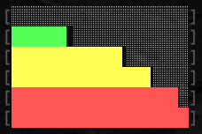

# context-usage-bar

Simply a customized status bar to show the things I want, and only those things.

# Features

- Input and output token count.
- Context usage progress bar:
    - Green when <80K tokens in window ("smart zone")
    - Yellow from 80K => 120K tokens (warning)
    - Red above 120K tokens ("dumb zone")
- Provider and model selection.
- Current branch.

# The Progress Bar

The progress bar is color coded to warn when we're approaching [the "Dumb Zone"](https://youtu.be/rmvDxxNubIg?si=O17nmS3SScaAkpp-&t=355). When it gets to yellow, start thinking about ["intentional compaction"](https://www.humanlayer.dev/blog/advanced-context-engineering) or exporting the current plan to pick up in a fresh session.

The color coding is based on a theoretical threshold of about 80K tokens, not based on total percentage of the model's context window. The limitation is still based on the size of the content in the window and how well focused the content is. [Using a 1M token window doesn't help if your context window is not well focused](https://www.humanlayer.dev/blog/long-context-isnt-the-answer).

# Other Extensions

Context bar components from other extensions display directly to the left of the progress bar (example: my [plan-mode extension](./plan-mode.md)).
