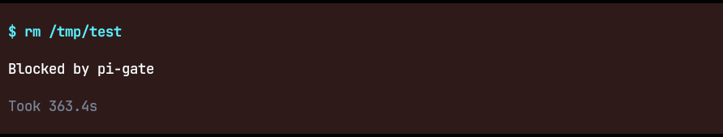
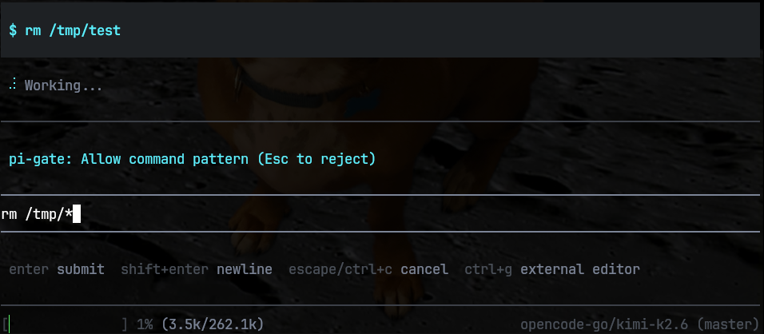
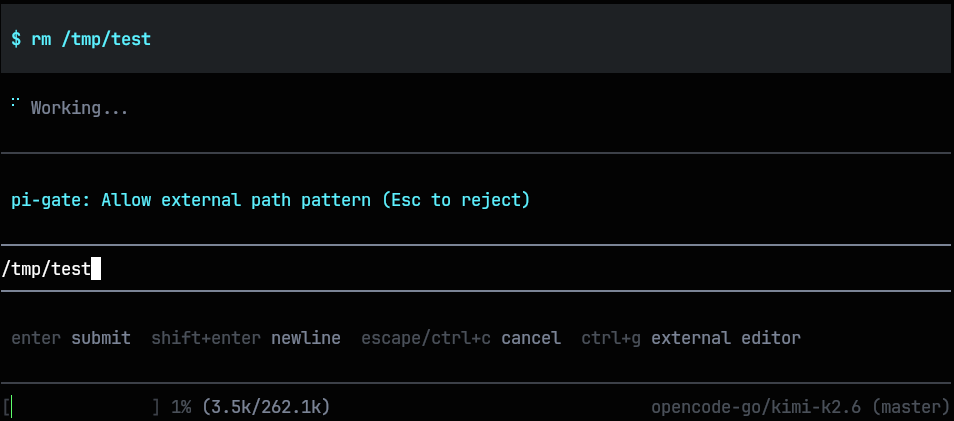
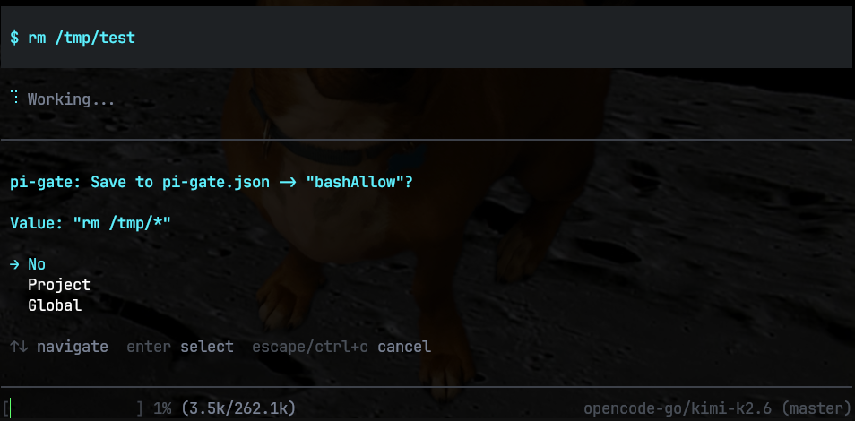

# pi-gate

A "guard rails" system for restricting bash commands and external file access by the agent.



Design philosophy:

1. "Ask" by default, always. Don't outright block things, sometimes you need to let the model run a dangerous command once.
2. Allow me to specify a glob or pattern to allow instead of the exact command so I don't get constantly prompted for the same action.
3. If I approve something, don't prompt me for that same thing again.
4. Ask to automatically add the pattern as a global or project-level white-list.
5. "Train" the agent over time by building-up session, project, global white-lists.

A global white-list might have things like:

```json
{
  "bashAllow": [
    "ls *",
    "echo *",
    "whoami",
    "echo *",
    "cat *",
    "ls *",
    "wc *",
    "grep *",
    "find *",
    "head *",
    "tail *",
    "touch *",
    "mkdir *",
    "git status*",
    "git add *",
    "git diff*",
    "git log*"
  ],
  "externalAllow": ["/home/dave/.pi/agent/extensions/pi-gate.json", "/tmp/*", "/dev/null", "/home/dave/tmp/*"]
}
```

A project level white-list might project-specific patterns:

```json
{
  "bashAllow": ["npm run*", "npx tsc *", "npx prettier*", "npx ts-node *", "npx tsx *", "npx eslint*", "mdl*"],
  "externalAllow": ["/home/dave/.local/share/uv"]
}
```

And your session white-list contains all of the actions you have approved, but decided not to save to a config file. It's managed internally, you never see it or modify it directly. You can accept the exact command/path, or modify it to use a glob pattern to make the rule more broad.

```jsonc
{
  "bashAllow": [
    "rm /tmp/tempfile.md",    # one-time command, exact
    "rm /tmp/*",              # just allow rm for all of /tmp for the session
    "npm install*",           # probably a bad idea...
  ],
  "externalAllow": [
    "/home/*"                 # allow accessing anything in ~ for the session
  ]
}
```

## Bash

All bash commands are parsed into an AST using [bash-parser](https://github.com/vorpaljs/bash-parser/tree/master). Every command and file path extracted from the command string are checked individually.

This isn't perfect. It turns out parsing bash commands can get pretty complicated. Instead of trying to make something strong enough to block Mythos from trying to escape my sandbox, I'm focused on just stopping a confused agent from making a mess.



## External Files

External files (outside of the project root directory) are also protected. I have hooked into the Read, Write, Edit, Find, Grep tools to compare the target file paths, and we extract file paths from any Bash tool calls and compare those as well.



## Session

If you approve a command, path, or pattern, it will be honored for the rest of the session and will not prompt you again until the agent is reloaded or restarted. You don't have to save an approved pattern to a configuration file.

Example: If you approve the pattern `*` for a bash prompt and do not save it to a config file, it will allow all bash commands to run without prompting for the rest of the session.

## Configuration

I have split the configuration into global and project level settings files. Since we only have a very simple opt-in pattern, we don't have to implement any kind of override logic. We don't even care about order or which file takes precedence. The lists are simply joined together into an effective working white-list.



The global config file:

```
$HOME/.pi/agent/extensions/pi-gate.json
```

And the per-project config file:

```
./.pi/extensions/pi-gate.json
```
