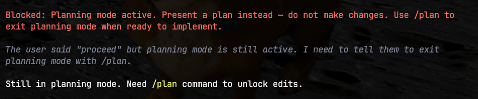

# plan-mode

Simple "plan mode" implementation.

> TODO: Grab a better preview image with a proper plan.


# Features

- Plan mode is "ON" by default, and re-enabled when you start a `/new` session.
- Blocks all tool calls and bash commands that would "make changes", while allowing read-only operations.
- Augments the system prompt with instructions to operate in "plan mode" and to present the user with a detailed plan when they would normally take action, but plan mode is active. When plan mode is inactive, the changes are removed from the system prompt.
- Visual indicator in the context bar.
- Can be disabled/toggled with `/plan` or using a hot-key.
- Can start `pi` with plan mode disabled using `--no-plan` flag.
- Deterministic code with a very small system prompt change, vs. Claude Code which is 90% prompts with _multiple_ HUGE system prompts.

## Tool Call Filter

This is where I really like `pi` over Claude Code: we can use deterministic code to control things instead of writing complex prompts and hoping the AI doesn't forget our instructions.

The `Edit` and `Write` tool calls are blocked when plan mode is active.

Any `Bash` calls are parsed using a bash AST parser and inspected to see if the command(s) would cause any modifications.

When a tool call is blocked, we return a message to the AI, reminding it that it's in plan mode and should present a plan instead.



## Visual Indicator

When plan mode is active, the context bar will show a visual indicator. When plan mode is deactivated, it will disappear.


## Hot-key and Options

You can toggle plan mode with a hot-key:

```text
Ctrl+Shift
```

(Temporary mapping; will probably make an option, if possible).

Or with a slash-command from within `pi`:

```text
/plan
```

## System Prompt

Even though we can block everything deterministically with the hooks, it isn't the best user experience and it seems to confuse the agent. So I gave it some instructions in the system prompt to help it out, and had the blocked tool calls return structured messages to tell the agent what's going on.

A nice feature of `pi` is how easy it is to change the system prompt. Since the system prompt always gets sent at the beginning of the context window, it doesn't slide out of scope like a normal instruction would. `Pi` let's you modify the system prompt at any time so we can even remove out customization when plan mode is disabled, and it won't go to the AI with the next request.
