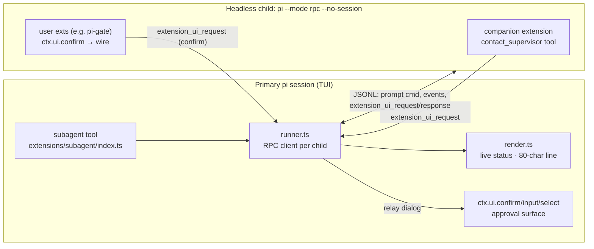
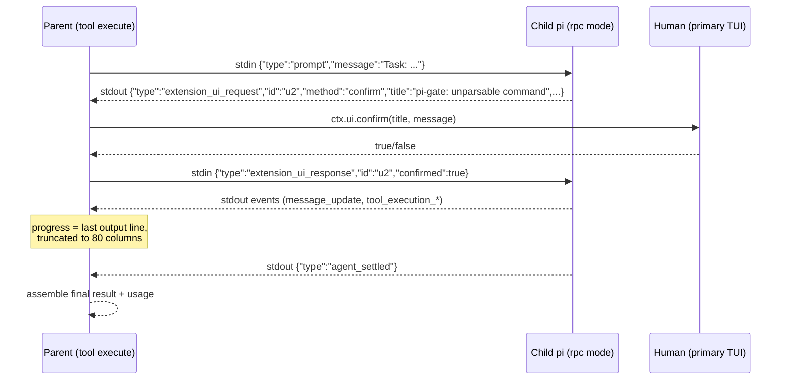

# Plan: `subagent` extension

Delegate tasks to headless `pi --mode rpc` child processes from a single
`subagent` tool, with approval prompts relayed to the primary session and
live per-subagent progress (most recent output line, truncated to 80 columns).
Ships one bundled `worker` agent; users can define custom agents globally
(`~/.pi/agent/agents/`) or per-project (`.pi/agents/`).

Status: **decisions locked, ready to implement.** No code has been written.

## Decisions (user-approved)

| # | Question | Decision |
|---|---|---|
| D1 | Communication mechanism | **A — RPC-pipe relay.** Parent extension is the RPC client of each headless child. Approvals flow natively via the `extension_ui_request` / `extension_ui_response` subprotocol; progress is parsed from the child's session event stream. A small companion extension injected into the child via `--extension` registers a child-only `contact_supervisor` tool (built on `ctx.ui.input`, so it rides the same relay). No pi-intercom dependency, no filesystem channel, no broker. |
| D2 | Tool semantics | **A — Blocking tool with streaming status, parallel dispatch required.** `subagent` blocks until the child(ren) finish; live status renders through `onUpdate` partial results plus a `ctx.ui.setStatus` footer line. Parallel mode (`tasks: [...]`) spawns one process per task, all concurrent, tool blocks until all complete. |
| D3 | Agent scope / project trust | **A — Default scope `both` with a confirmation gate.** Bundled + user + project agents are visible by default. When a tool call references a project-sourced agent and `ctx.isProjectTrusted()` is false, the user gets a one-shot `ctx.ui.confirm` before spawning; when the parent session has no dialog-capable UI (`!ctx.hasUI`), the call is refused with an error (fail closed — the confirm gate cannot be shown, so the threat it covers is unmitigated). Per-call `agentScope` override (`user` / `project` / `both`). |
| D4 | Typecheck version pins | **A — Keep `@earendil-works/*` dev pins at 0.85.1.** All planned APIs verified present in the pinned type declarations; the RPC wire protocol is the documented stable contract. The runner hand-rolls ~80 lines of JSONL framing instead of importing `RpcClient`, specifically to avoid client (0.85.1) / child runtime (0.99.1) skew. |

### Rejected alternatives and why

- **Filesystem channel** (pi-subagents `native-supervisor-channel.ts` style):
  decoupled from transport, but reinvents what RPC mode already provides,
  adds polling and stale-file handling, and approvals would be a second,
  parallel mechanism instead of pi's native dialog subprotocol.
- **Real pi-intercom dependency** (broker + extension channels): makes
  subagents first-class intercom citizens, but requires pi-intercom installed
  and enabled in every child, adds broker lifecycle, and is the most code.
  Intercom citizenship was orthogonal to the stated goals.
- **Async spawn with fleet widget** (pi-interactive-subagents style): roughly
  doubles the code (job registry, steer-back delivery, widget state across
  session reloads). The blocking model already shows live progress and
  parallel children; an async layer can be added later on top of the same
  runner/render modules.
- **Default scope `user` only** (official example's default): protects
  against a threat D3's untrusted-project confirm already covers, at the cost
  of project agents silently not being found.
- **Bump dev pins to 0.99.1**: correct as its own maintenance chore, but
  would re-typecheck every other extension in the repo against a newer SDK;
  kept out of this feature.

## Requirements (final)

1. One `subagent` tool; single mode `{agent, task, cwd?}` and parallel mode
   `{tasks: [{agent, task, cwd?}, ...]}` — parallel dispatch is a
   first-class requirement.
2. Children are headless `pi --mode rpc --no-session` processes spawned by
   the tool, each with an isolated context window.
3. Any dialog that would prompt in a child (`ctx.ui.confirm/select/input/
   editor` from any loaded extension, e.g. pi-gate, or the child's
   `contact_supervisor` tool) is relayed to the primary session's TUI and
   the answer returned to the child.
4. Live progress while running: per-subagent most-recent-output line,
   truncated to 80 display columns, via `onUpdate` streaming and a
   `setStatus` footer entry.
5. Bundled `worker` agent; custom agents discoverable globally and
   project-locally; precedence project > user > bundled on name collision.
6. Untrusted-project confirmation for project-sourced agents (D3); fail
   closed with an error when the parent session has no UI to show the
   confirmation.
7. Nesting guard: a child process must not register the `subagent` tool.
8. Abort support: tool `AbortSignal` aborts the child(ren).

## References examined

| Source | What is borrowed |
|---|---|
| pi `examples/extensions/subagent/` (0.99.1) | Agent discovery (`agents.ts` frontmatter parsing, project dir walk-up), `getPiInvocation()`, spawn/abort pattern, usage accumulation from `message_end`, `mapWithConcurrencyLimit`, renderer skeleton |
| pi `docs/rpc-extension-ui.md` | Approval relay mechanics: dialog methods become `extension_ui_request` on child stdout; responses written to child stdin |
| pi `docs/json.md`, `docs/rpc.md` | JSONL framing rules (split on LF only, never `readline`; keep draining stdout), prompt command / disposition / `agent_settled` lifecycle |
| pi-subagents 0.35.1 `src/intercom/native-supervisor-channel.ts`, `src/runs/shared/pi-args.ts` | `contact_supervisor` tool shape, env-var child marker pattern (`PI_SUBAGENT_CHILD`), `--extension` companion injection, module-relative path resolution |
| pi-interactive-subagents (HazAT) | Agent precedence tiers, frontmatter conventions, confirmation that parallel dispatch + blocking model is viable |
| pi-intercom (nicobailon) | Child→supervisor "ask" UX: child asks, blocks, parent answers |

API availability verified against the repo's pinned
`@earendil-works/pi-coding-agent@0.85.1` and `pi-tui@0.85.1` type
declarations: `registerTool` with `renderCall`/`renderResult`,
`AgentToolResult<TDetails>` with `onUpdate`, `ctx.ui.confirm/select/input/
editor/notify/setStatus`, `ctx.hasUI`, `ctx.mode`, `ctx.isProjectTrusted()`,
`ctx.model`, `ctx.thinkingLevel`, `parseFrontmatter`, `getAgentDir`,
`CONFIG_DIR_NAME`, `withFileMutationQueue`, `truncateToWidth`.

## Architecture



Approval relay sequence:



Parallel dispatch: one `pi` process per task, all concurrent
(cap 8 tasks / 4 at a time, official example constants), stdout pipes
multiplexed in a single event loop; the tool call resolves when every child
reaches `agent_settled`. Approval dialogs from concurrent children queue in
the primary TUI one at a time — both children block until each dialog is
answered (documented behavior).

Progress rule: on `message_update` whose nested `assistantMessageEvent` is a
`text_delta` (wire records are delta-only: `event.assistantMessageEvent`
carries `type`, `contentIndex`, `delta`; `thinking_delta` blocks are
ignored), buffer deltas per `contentIndex` and take the last non-empty line
of the current text block; on `tool_execution_update`, take the last line of
`partialResult` text; on `tool_execution_start`, synthesize
`→ <toolName> <arg preview>`; truncate to 80 columns with `truncateToWidth`
from `@earendil-works/pi-tui`.
Push via `onUpdate` partial results (with `details`) and
`ctx.ui.setStatus('subagent', ...)`; clear the status entry on completion.

Headless-parent fallback: when the primary session has no dialog-capable UI
(`!ctx.hasUI`), relayed dialogs are answered immediately with
`cancelled: true` / `confirmed: false` so children never hang, and the D3
gate refuses project-sourced agents with an error instead of prompting.

## Files

### New: `extensions/subagent/agents/worker.md`

Modeled on the official example's worker, trimmed:

```markdown
---
name: worker
description: General-purpose subagent with full capabilities, isolated context
---

You are a worker agent operating in an isolated context window. Work
autonomously to complete the assigned task using all available tools.

If blocked by a decision only the orchestrator can make, use the
`contact_supervisor` tool to ask, then continue with the answer.

Output format when finished:

## Completed
What was done.

## Files Changed
- `path/to/file.ts` - what changed

## Notes (if any)
Anything the main agent should know.
```

### New: `extensions/subagent/agents.ts` (~190 lines)

Port of the official example's discovery, restructured for testability (no
`process.env` access — repo AGENTS.md rule) with bundled-dir support:

```typescript
/**
 * Agent discovery and configuration for the subagent extension.
 */
import * as fs from 'node:fs';
import * as path from 'node:path';
import { fileURLToPath } from 'node:url';
import { CONFIG_DIR_NAME, getAgentDir, parseFrontmatter } from '@earendil-works/pi-coding-agent';

/** Where an agent definition came from. */
export type AgentSource = 'bundled' | 'user' | 'project';

/** A parsed agent definition. */
export interface AgentConfig {
  name: string;
  description: string;
  tools?: string[];
  model?: string;
  systemPrompt: string;
  source: AgentSource;
  filePath: string;
}

export type AgentScope = 'user' | 'project' | 'both';

/** Injectable agent directories (tests pass temp dirs). */
export interface AgentDirs {
  bundled: string;
  user: string;
  project: string | null;
}

/** Resolve default dirs: bundled next to this module, user from getAgentDir(), project walked up from cwd. */
export function resolveAgentDirs(cwd: string): AgentDirs { /* ... */ }

/** Discover agents; precedence project > user > bundled per name. */
export function discoverAgents(dirs: AgentDirs, scope: AgentScope): AgentConfig[] { /* ... */ }
```

- `bundled` dir = `path.join(fileURLToPath(new URL('.', import.meta.url)), 'agents')`
  (same technique as pi-subagents `pi-args.ts`).
- User dir = `path.join(getAgentDir(), 'agents')`; project dir = nearest
  `.pi/agents` walking parents (official example `findNearestProjectAgentsDir`).
- Precedence: iterate `bundled → user → project` into a Map so later sources
  overwrite earlier ones (differs from the official example, which has no
  bundled tier).
- `tools:` frontmatter accepts string or array (official example
  `parseToolList`); a malformed file is skipped, never fatal.

### New: `extensions/subagent/progress.ts` (~70 lines)

Pure functions, unit-tested:

```typescript
/** Maximum width of a subagent status line, in display columns. */
export const STATUS_MAX_WIDTH = 80;

/** Mutable per-child progress extraction state. */
export interface ProgressState { textBuffer: string; lastLine: string }

export function createProgressState(): ProgressState { return { textBuffer: '', lastLine: '' }; }

/** Extract a display status line from one session event record. */
export function statusLineFromEvent(event: unknown, state: ProgressState): string | undefined {
  // tool_execution_start      → `→ bash npm test…`
  // message_update            → read event.assistantMessageEvent; only
  //                             `text_delta` blocks count (ignore
  //                             `thinking_delta`); buffer deltas per
  //                             `contentIndex`, return last non-empty line
  //                             of the active text block
  // tool_execution_update     → last line of partialResult text
}

/** Truncate to STATUS_MAX_WIDTH display columns (pi-tui truncateToWidth). */
export function truncateStatus(line: string): string { /* ... */ }
```

### New: `extensions/subagent/runner.ts` (~330 lines)

The core. Hand-rolled minimal RPC client following `json.md` framing rules
(split stdout on LF only — never `readline`; keep draining to avoid pipe
backpressure), structured after the official example's `runSingleAgent` but
over RPC:

```typescript
/**
 * Spawns and drives one headless `pi --mode rpc` child process.
 */
import { spawn, type ChildProcess } from 'node:child_process';
// NOTE: AgentToolResult is re-exported from pi-coding-agent (the official
// example imports it from @earendil-works/pi-agent-core, which is NOT a
// dependency of this repo). Message comes from pi-ai (a peer dep).
import type { Message } from '@earendil-works/pi-ai';
import type { AgentToolResult, ExtensionContext } from '@earendil-works/pi-coding-agent';

/** Injectable process factory so tests never spawn real processes. */
export interface SpawnFn {
  (command: string, args: string[], opts: { cwd: string; env: NodeJS.ProcessEnv }): ChildProcess;
}

/** Usage accumulator, ported from the official example (`index.ts:139-148`). */
export interface UsageStats {
  input: number;
  output: number;
  cacheRead: number;
  cacheWrite: number;
  cost: number;
  contextTokens: number;
  turns: number;
}

/** One live subagent run. */
export interface SubagentRun {
  agent: string;
  task: string;
  statusLine: string;        // live, ≤80 cols
  messages: Message[];
  usage: UsageStats;
  exitCode: number | null;   // null = running
  errorMessage?: string;
}

export interface RunSubagentOptions {
  agent: AgentConfig;
  task: string;
  cwd: string;
  model?: string;            // inherits parent model when agent.model unset
  tools?: string[];
  signal?: AbortSignal;
  /** Relay target for child dialogs; omitted → dialogs auto-cancel. */
  ui?: Pick<ExtensionContext['ui'], 'confirm' | 'select' | 'input' | 'editor' | 'notify'>;
  hasRelayUI: boolean;
  onProgress?: (run: SubagentRun) => void;
  spawnFn?: SpawnFn;
}

export async function runSubagent(opts: RunSubagentOptions): Promise<SubagentRun> { /* ... */ }
```

Behavior:

1. **Args**: `['--mode','rpc','--no-session','--name',agent.name]`, plus
   `--model`, `--tools`, `--append-system-prompt <tmpfile>` when present,
   plus `--thinking <level>` when the model is inherited and
   `ctx.thinkingLevel` is set (official example `index.ts:304-305`), plus
   `--extension <abs path to child-extension.ts>` always. Env adds
   `PI_SUBAGENT_CHILD: '1'`. Spawn via `getPiInvocation()` (ported from the
   official example `index.ts:249-264`): if `process.argv[1]` exists as a
   file (and is not a bun virtual script), spawn `process.execPath` with
   that script; else if the `execPath` basename is not a generic `node`/`bun`
   runtime, spawn `process.execPath` directly; else fall back to `pi` on
   PATH.
2. **Stdout loop**: buffer → split LF → per record:
   - `extension_ui_request` → `relayDialog(record, ui)`:
     `confirm`→`ui.confirm`, `select`→`ui.select`, `input`→`ui.input`,
     `editor`→`ui.editor`; write the matching `extension_ui_response` to
     stdin. If `!hasRelayUI`, respond immediately `cancelled:true` /
     `confirmed:false`. Fire-and-forget methods: forward `notify` to
     `ui.notify`, ignore the rest. Dialog handling is async per request; the
     read loop never blocks.
   - `message_update` / `tool_execution_*` → `statusLineFromEvent` →
     `onProgress`.
   - `message_end` (assistant) → append message, accumulate usage (official
     example `index.ts:362-383`).
   - `agent_settled` → resolve.
   - process `close` → resolve the run even if `agent_settled` never
     arrived (child crash / kill); a non-zero exit code without a prior
     `agent_settled` sets `errorMessage` and the run is treated as failed.
3. **Prompt**: after subscribing, write
   `{"id":"prompt-1","type":"prompt","message":"Task: "+task}` + LF to stdin;
   correlate the `response` record by id (rpc.md guidance) and inspect it:
   `success: false` → fail the run with the response's error; check
   `data.disposition` — `started`/`queued` → keep waiting for
   `agent_settled`, but `"handled"` means no run started (rpc.md: don't wait
   for `agent_settled`) → fail the run with an explanatory `errorMessage`
   instead of hanging.
4. **Abort**: on `signal`, write `{"type":"abort"}` (rpc-commands `abort`),
   then SIGTERM → SIGKILL after 5 s (official example pattern,
   `index.ts:410-419`).
5. **Cleanup**: close stdin (orderly RPC shutdown), remove temp prompt file,
   ensure process exit; all idempotent.

### New: `extensions/subagent/child-extension.ts` (~60 lines)

Loaded only inside the child via `--extension`:

```typescript
/**
 * Companion extension injected into subagent child processes.
 * Registers the child-only contact_supervisor tool.
 */
import type { ExtensionAPI } from '@earendil-works/pi-coding-agent';
import { Type } from 'typebox';

export default function (pi: ExtensionAPI) {
  pi.registerTool({
    name: 'contact_supervisor',
    label: 'Contact Supervisor',
    description:
      'Ask the supervising pi session a question when blocked (e.g. an ambiguity, ' +
      'a destructive action you are unsure about). Blocks until the supervisor answers.',
    parameters: Type.Object({
      question: Type.String({ description: 'The question to ask the supervisor' }),
    }),
    async execute(_toolCallId, params, _signal, _onUpdate, ctx) {
      if (!ctx.hasUI) {
        return { content: [{ type: 'text', text: 'No supervisor channel available.' }], details: undefined };
      }
      const answer = await ctx.ui.input('Subagent asks', params.question);
      if (answer === undefined) {
        return {
          content: [{ type: 'text', text: 'Supervisor dismissed the question. Proceed with best judgment.' }],
          details: undefined,
        };
      }
      return { content: [{ type: 'text', text: `Supervisor reply: ${answer}` }], details: undefined };
    },
  });
}
```

In the child's RPC mode, `ctx.ui.input` emits an `extension_ui_request` on
stdout and blocks — the parent's runner relays it to the primary TUI and
writes the response back to the child's stdin. No separate channel needed.

### New: `extensions/subagent/render.ts` (~150 lines)

Simplified port of the official example renderers:

- `renderCall`: `subagent worker [both]` + 60-char task preview; parallel
  mode lists up to 3 tasks then `+N more`.
- `renderResult` collapsed: per-run status icon (`⏳ running` / `✓` / `✗`)
  plus the live 80-char status line; parallel shows `done/total` header.
- `renderResult` expanded: final assistant markdown (`Markdown` +
  `getMarkdownTheme()`), per-run usage line (`↑12k ↓3k $0.0042` trimmed
  `formatUsageStats`), parallel aggregates `Total:` usage.
- Status updates mid-run arrive through `onUpdate` partial results carrying
  `details`, so the collapsed renderer shows live progress while the tool
  call is still open.

### New: `extensions/subagent/index.ts` (~200 lines)

```typescript
/**
 * subagent extension: delegate tasks to headless `pi --mode rpc` child
 * processes, with approvals relayed to this session and live progress.
 */
import type { ExtensionAPI } from '@earendil-works/pi-coding-agent';
import { Type } from 'typebox';
import { discoverAgents, resolveAgentDirs } from './agents.ts';
import { runSubagent } from './runner.ts';

/** Factory with injectable environment (tests pass fake env; no process.env mutation). */
export function createSubagentExtension(env: NodeJS.ProcessEnv) {
  return function (pi: ExtensionAPI) {
    if (env.PI_SUBAGENT_CHILD) return; // child: companion extension only, no nesting

    pi.registerTool({
      name: 'subagent',
      label: 'Subagent',
      description: [/* single + parallel modes, discovery dirs, contact_supervisor hint */].join(' '),
      parameters: SubagentParams, // {agent, task, cwd?} | {tasks: [{agent, task, cwd?}], agentScope?, cwd?}
      async execute(_toolCallId, params, signal, onUpdate, ctx) {
        // 1. discoverAgents(resolveAgentDirs(ctx.cwd), scope)
        // 2. validate exactly one mode; unknown agent → error listing available agents
        // 3. D3 gate: project-sourced agents + !ctx.isProjectTrusted() →
        //    ctx.ui.confirm; if !ctx.hasUI the confirm cannot be shown →
        //    fail closed with an error result
        // 4. single → runSubagent; parallel → mapWithConcurrencyLimit(tasks, 4, runSubagent)
        //    onProgress → onUpdate partial AgentToolResult<SubagentDetails>
        // 5. assemble content + details; failed run → isError: true
      },
      renderCall: /* from render.ts */,
      renderResult: /* from render.ts */,
    });
  };
}

export default createSubagentExtension(process.env);
```

Constants (official example): `MAX_PARALLEL_TASKS = 8`,
`MAX_CONCURRENCY = 4`, `PER_TASK_OUTPUT_CAP = 50 KiB` with a truncation note
pointing at tool details.

Model inheritance: `agent.model` wins; otherwise the parent's
`ctx.model` (`provider`/`id`, i.e. `--model "${ctx.model.provider}/${ctx.model.id}"`)
and `ctx.thinkingLevel` (via `--thinking`, see runner args) are passed
through, as the official example does with `inheritsDispatchConfig`.

### New: `docs/extensions/subagent.md`

User-facing doc: tool params and both modes, agent frontmatter reference
(`name`, `description`, `model`, `tools`), discovery precedence
(project > user > bundled), the approval relay (including the headless-parent
auto-cancel behavior, the headless fail-closed D3 gate, and the
parallel-dialogs-queue-one-at-a-time behavior), `contact_supervisor` usage,
and the tuning constants.

### Diff: `README.md`

Insert after line 39 (`[Read more here](./docs/extensions/pi-gate.md).`),
before `## Themes` (line 41):

```diff
--- a/README.md
+++ b/README.md
@@ -38,6 +38,24 @@
 [Read more here](./docs/extensions/pi-gate.md).
 
+### subagent
+
+Delegate tasks to headless `pi --mode rpc` child processes with isolated
+context. Ships one bundled `worker` agent; drop `.md` agent definitions in
+`~/.pi/agent/agents/` (global) or `.pi/agents/` (project, wins on name
+collision) to add your own.
+
+The parent session is the RPC client, so anything that would prompt in the
+child — a `ctx.ui.confirm` from an extension like pi-gate, or the child's
+`contact_supervisor` tool — is relayed to your primary session for approval,
+and running subagents stream their most recent output line (80 cols) as
+live status.
+
+[Read more here](./docs/extensions/subagent.md).
+
 ## Themes
```

### `package.json` — no change required

`pi.extensions: ["./extensions"]` (package.json:8-10) already traverses the
directory; per `docs/extensions.md` ("Extension locations"), subdirectories
with an `index.ts` entry point load automatically. Tests: `node --test
test/**/*.test.ts` (package.json:27) picks up the new test directory.

## Tests (`test/extensions/subagent/`)

Repo rules honored: `withTempDir` (test/utils/temp-dir.ts) for filesystem
work, no `process.env` writes, no real child spawns, harness from
test/utils/pi-harness.ts where registration behavior is asserted.

| File | Covers |
|---|---|
| `agents.test.ts` | Precedence project > user > bundled via injected `AgentDirs`; scope filtering; `tools:` string vs array parsing; malformed frontmatter skipped; walk-up project discovery |
| `progress.test.ts` | `statusLineFromEvent` for text_delta / tool_execution_start / tool_execution_update; 80-column truncation incl. wide chars |
| `runner.test.ts` | Fake `SpawnFn` returning an EventEmitter-based mock child; canned JSONL: prompt command written to stdin; prompt `response` handling (`success:false`, `disposition:"handled"` → failed run, no hang); `extension_ui_request` → fake ui → correct `extension_ui_response` framing (confirm/select/input + cancel paths); `!hasRelayUI` auto-cancel; usage accumulation; abort → `abort` command then SIGTERM; `agent_settled` resolution; process `close` without `agent_settled` resolves the run (non-zero exit → `errorMessage`); temp-file cleanup |
| `index.test.ts` | Harness: `subagent` tool registered; `createSubagentExtension({ PI_SUBAGENT_CHILD: '1' })` registers nothing (nesting guard); unknown-agent error lists available agents; D3 confirm gate fires for project agents when untrusted; D3 gate fails closed (error, no spawn) when `!ctx.hasUI` |

## Verification commands

```bash
cd ~/source/dave-pi-extensions
npm test                 # node --test test/**/*.test.ts
npm run typecheck        # tsc --noEmit (against pinned 0.85.1 types)
npx eslint .
npm run format:check
mdl README.md docs/extensions/subagent.md   # docs changed
```

Protocol-level smoke (exactly what runner.ts does programmatically — note
this *does* make a real model call, so a configured provider/auth is
required):

```bash
pi --mode rpc --no-session <<'EOF'
{"id":"1","type":"prompt","message":"Reply with exactly: ok"}
EOF
```

End-to-end from a scratch directory:

```bash
mkdir -p /tmp/subagent-e2e && cd /tmp/subagent-e2e
pi --extension ~/source/dave-pi-extensions/extensions/subagent/index.ts
# then: "use the subagent tool with the worker agent to list files in /tmp"
# expect: live status line, final worker report; with pi-gate loaded, a
# relayed confirm dialog in this session if the child hits an unparsable command
```

## Out of scope (future work)

- Chain mode (`{previous}` placeholder) — trivial follow-up on the runner
- Async/background runs with a persistent fleet widget (`setWidget`) and
  steer-back result delivery
- Child session persistence (`--session`, resume, lineage)
- Structured output (`outputSchema` / `structuredContent`)
- Steering/interrupting a running child beyond turn-level abort
- Real pi-intercom channel integration (option C) if subagents ever need to
  be messaged by *other* sessions, not just their spawner
